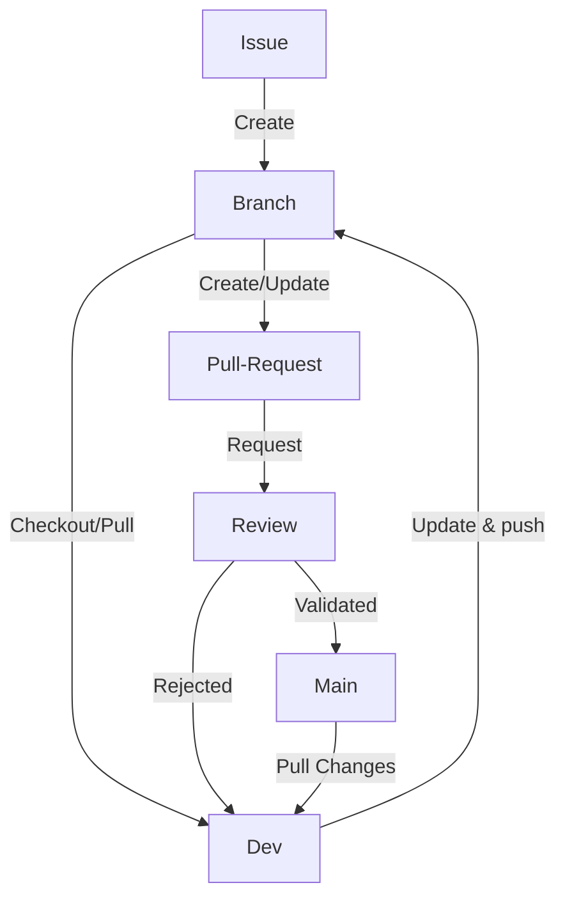

# 🖋️ Contribution guide

All development is done through a process using [issues](https://github.com/ioprodz/ioprodz/issues) on this repositories.

## How issues are created

### 🌼 New features

Changes to introduce new features, alter architecture and in general have large impact on the code base are pre-qualified in the [project managment tools](https://github.com/orgs/ioprodz/projects/3/views/2) of ioprodz, They pass different stages of :

- Idea: this is where intentions to change the platform land. The idea owner should write a proposal that can be discussed by community members.
- Challenge: Discussion between owner and other dev community members to qualify the idea to a product feature.
- Spec: Here where the functional and technical aspects of how to implement the feature will be written.
- Priorities: Here means the feature is ready to be worked on code-wise, and it will be picked by a delivery owner (can be other than the idea owner), At this stage an issue will be created on the repository and can be picked up to delivery
- Delivery: In this stage the issue is being handled by a developer or more.

### 🐛 Bugs

Issues can be created according to defects found in the platform and will be treated in the normal delivery process.

## ✋ Owning an issue

When you are assigned an issue, you should:

- link it to a branch/Draft pull request. ↔️
- checkout the branch locally and work on it ⏬

### 📨 Checking in code

#### Branching, Commits and pushes

- all work must be done on a feature branch.
- Commits should be small
- commit message conventions:
  ```
  type(scope): description
  ```
  examples:
  ```
  feat(icosium): added like button
  fix(hoggar): added missing validation rule
  chore(docs): documented new api endpoint
  refactor(icosium): split long function in to small
  ```
- No direct pushes to `main`

#### ⏫ Pull requests

- should be always `rebased` and have no conflicts with main.
- when done working, Pull request shoud be passed from Draft to Ready, and have reviewers assigned.
- Once you have 2 approuvals, you can squash and merge your changes.

### 🕵️ Code checks and reviews

- When a pull-request is open, it will under go a set of automatic checks (CI). The status of these checks can be checked at the bottom of the conversations, they have to pass in order to request a review and merge.

- Reviews are mandatory and their goal is:
  - Learn and be informed on what is changing on the code-base
  - Ensure the changes are withing the scope of the issue
  - Respect the architecture
  - Spot issues related to security, introduction of useless dependencies
  - Avoid over-engineering

### Dev Workflow



Note: this flow-chart is made with [mermaid](https://mermaid-js.github.io/mermaid)

Go back to [README.md](README.md)
